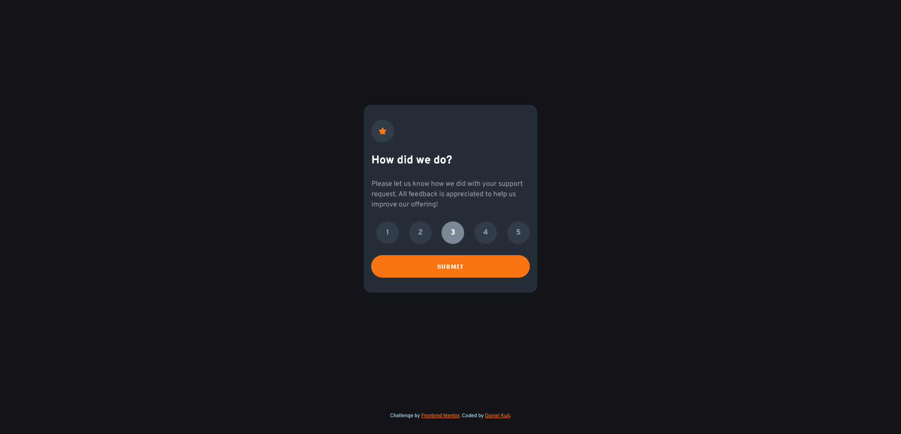

# Frontend Mentor - Interactive rating component solution

This is a solution to the [Interactive rating component challenge on Frontend Mentor](https://www.frontendmentor.io/challenges/interactive-rating-component-koxpeBUmI). Frontend Mentor challenges help you improve your coding skills by building realistic projects.

## Table of contents

- [Overview](#overview)
  - [The challenge](#the-challenge)
  - [Screenshot](#screenshot)
  - [Links](#links)
- [My process](#my-process)
  - [Built with](#built-with)
  - [What I learned](#what-i-learned)
  - [Continued development](#continued-development)
  - [Useful resources](#useful-resources)
- [Author](#author)
- [Acknowledgments](#acknowledgments)

## Overview

### The challenge

Users should be able to:

- View the optimal layout for the app depending on their device's screen size
- See hover states for all interactive elements on the page
- Select and submit a number rating
- See the "Thank you" card state after submitting a rating

### Screenshot




### Links

- Solution URL: [GitHub repository](https://github.com/danielkull/FrontM-interactive-rating-component)
- Live Site URL: [Live site from GitHub](https://danielkull.github.io/FrontM-interactive-rating-component/)

## My process

### Built with

- Semantic HTML5 markup
- CSS custom properties
- Flexbox
- CSS Grid
- @media screen for breakpoints
- JS DOM

### What I learned

Using shadow inside of a button to give the user a feeling when it's activated.

```css
.btn-submit:active {
  box-shadow: inset 0 0 5px var(--dark-blue);
}
```

To use min or max-width/height in different ways to define a tile with it's content, but also make sure that the tiles look the same, without content loss.

```css
.content-tiles {
  display: grid;
  place-content: center;
  padding: 2rem 1rem;
  gap: 1.5rem;

  max-width: min-content;
  min-height: 25rem;
}

p {
  min-width: 31ch;
}

.rating-response {
  min-width: fit-content;
}
```

Creating an array from a selected html element with css selector like structure(like here with input elements in the wrapper-rating), to then work with it.

```js
const inputList = Array.from(
  document.querySelectorAll(".wrapper-rating input")
);
```

### Continued development

I want to focus more on placement of the html content with css. And also want to increase the html semantic knowledge about forms and its respective elements.
In addition working more with input and label elements witht the help of the CSS Tricks article (See Useful resources).

### Useful resources

- [CSS Tricks: HTML Inputs and Labels: A Love Story](https://css-tricks.com/html-inputs-and-labels-a-love-story/) - This helped me a lot to understand the interaction between input and label elements and gave me the push to overthink my html structure.

## Author

- GitHub Page - [Daniel Kull](https://github.com/danielkull)
- Frontend Mentor - [@danielkull](https://www.frontendmentor.io/profile/danielkull)

## Acknowledgments

My thanks goes again to the Coding-bootcamps-eu, it's teachers and fellow students.
Also a special thanks to Amber Wilson's article, about Inputs and Labels on CSS Tricks, which gave me a deeper understanding.
